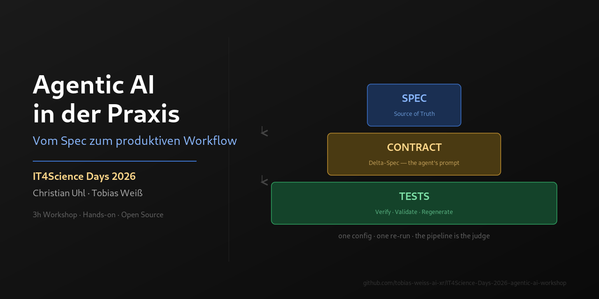

# IT4Science Days 2026 — Agentic AI Workshop
> **⚠️ Migrated from Codeberg → GitHub**: This repository has moved permanently to [GitHub](https://github.com/tobias-weiss-ai-xr/IT4Science-Days-2026-agentic-ai-workshop). The Codeberg mirror is deprecated.

> **Format:** 3h Workshop (09:00–12:00) · Sprache: Deutsch



## Über den Workshop

Dieser Workshop auf den IT4Science Days 2026 zeigt praxisnah, wie Large Language Models heute **agentisch** genutzt werden können, welche neuen Möglichkeiten sich daraus ergeben und wie solche Ansätze sinnvoll in eigene Projekte integriert werden können.

Im Mittelpunkt steht ein **Hands-on**: Jede Teilnehmende verlässt den Raum mit einem eigenen, CI-validierten Research-Repo. Im Anschluss Raum für Fragen, Diskussion und konkrete Anwendungsfälle aus der Praxis.

## Referenten

| Name | Institution |
|------|-------------|
| **Christian Uhl** | Zentrum für angewandte Informatik und Data Science, Universität Gießen |
| **Tobias Weiß** | DevOps Engineer, Universität Marburg — [tobias-weiss.org](https://tobias-weiss.org) |

Fortsetzung der Veranstaltungsreihe **HackyHour**.

## Agenda (3h, 09:00–12:00)

> Diese README ist die einzige Quelle der Wahrheit für den Ablauf.
> Die Marp-Folien liegen unter `docs/presentations/`.

| Zeit | Block | Dauer | Verantwortung |
|------|-------|-------|---------------|
| 09:00–09:10 | Ankommen, Vorstellung, Ablauf | 10 min | beide |
| 09:10–09:25 | Grundlagen & Definition — Was ist agentisches Arbeiten? | 15 min | Christian |
| 09:25–09:45 | Aktuelle Entwicklungen bei den Foundation Modellen | 20 min | Christian + Tobias |
| 09:45–10:05 | Open-Source Toolbox — OpenCode, OpenSpec, Lean + SAIA Accelerator | 20 min | Tobias + Christian |
| 10:05–10:15 | ☕ Pause | 10 min | — |
| 10:15–10:40 | **Anwendung 1: Eigenes Research Repo** — [skeleton-research](https://github.com/tobias-weiss-ai-xr/skeleton-research), Git, Harness | 25 min | beide |
| 10:40–11:00 | Spec Driven Development — Anforderungen als Treiber agentischer Entwicklung | 20 min | Christian |
| 11:00–11:10 | Token-optimized Development — oh-my-opencode, taskfleet, etc. | 10 min | Tobias |
| 11:10–11:35 | **Anwendung 2: Spec selbst anwenden** (im Research Repo) | 25 min | beide |
| 11:35–11:40 | ☕ Pause | 5 min | — |
| 11:40–12:00 | Q&A, TN präsentieren Outcomes, Diskussion, Wrap Up | 20 min | beide |

**Lernlogik der Reihenfolge:**
Grundlage → Werkzeuge → **sofort selbst anwenden (Research Repo)** → Vertiefung (Spec/Token) → **Spec selbst anwenden** → Austausch.

## Hands-on: skeleton-research

Das Herzstück des Workshops. [skeleton-research](https://github.com/tobias-weiss-ai-xr/skeleton-research) ist ein forkbares Skeleton für eine **datengetriebene, auto-validierte, agentische Literatur-Review** — dieselbe Architektur wie die `*-research`-Corpus-Repos.

- **Eine Datei genügt:** `config/taxonomy.yaml` (Thema, Kategorien, Queries) anpassen → Pipeline läuft.
- **Source of Truth:** `papers.yaml` — ein strukturierter Eintrag pro Paper.
- **Auto-Pipeline:** `validate_papers.py` → `generate_readme.py` → `standard_stats.py` → `generate_reports.py`.
- **Auto-Discovery:** CI entdeckt wöchentlich neue Paper (arXiv, OpenAlex, dblp, crossref, europepmc) und öffnet PRs.
- **GitHub Pages:** durchsuchbare Paper-Browser-Seite.
- **Agenten-tauglich:** `AGENTS.md` gibt Coding-Agenten klare Guardrails — eine Config, ein Re-Run, objektiver Pass/Fail.

**5-Schritt-Jump-Start:**

```bash
git clone https://github.com/tobias-weiss-ai-xr/skeleton-research.git my-topic-research
cd my-topic-research
# 1. Thema & Taxonomie definieren
$EDITOR config/taxonomy.yaml
# 2. Corpus seeden (5–10 Paper) oder auto-discovern
python3 scripts/fetch/fetch_new_papers.py --local
# 3. Validieren + generieren
python3 scripts/validate_papers.py && python3 scripts/generate_readme.py \
  && python3 scripts/standard_stats.py && python3 scripts/analysis/generate_reports.py
# 4. Commit & push
git add -A && git commit -m "bootstrap corpus" && git push
# 5. CI hält den Corpus gesund (wöchentliche Discovery, Validierung, Pages-Deploy)
```

## Arbeitsmaterialien

- `docs/presentations/it4science-days-2026-agentic-ai-workshop.md` — Marp-Folien (`.html` = gerendert)
- `docs/research-foundation-models-toolbox.md` — Recherche: Foundation Models & Toolbox (Ranking)
- `assets/spec-contract-test-pyramid.png` — die Spec·Contract·Test-Metapher
- `assets/teaser-banner.png` — Banner für Social/Titel

## Links

- [IT4Science Days Eventseite](https://plan.events.mpg.de/event/670/)
- [Impuls zu SpecDrivenDevelopment (GWDG News)](https://gwdg.de/about-us/gwdg-news/2026/GN_05-2026_www.pdf#page=14)
- [skeleton-research](https://github.com/tobias-weiss-ai-xr/skeleton-research) — forkbares Research-Corpus-Skeleton
- [SAIA Plugin für OpenCode](https://codeberg.org/graphwiz-ai/opencode-saia-plugin/src/branch/bleedingEdge)
- [OpenCode](https://github.com/sst/opencode) · [OpenSpec](https://github.com/FissionAI/OpenSpec)
