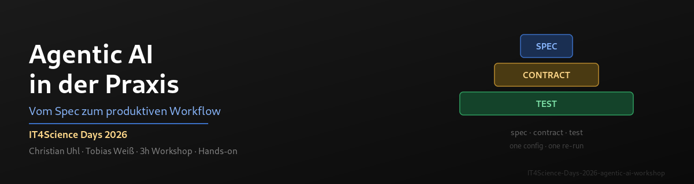
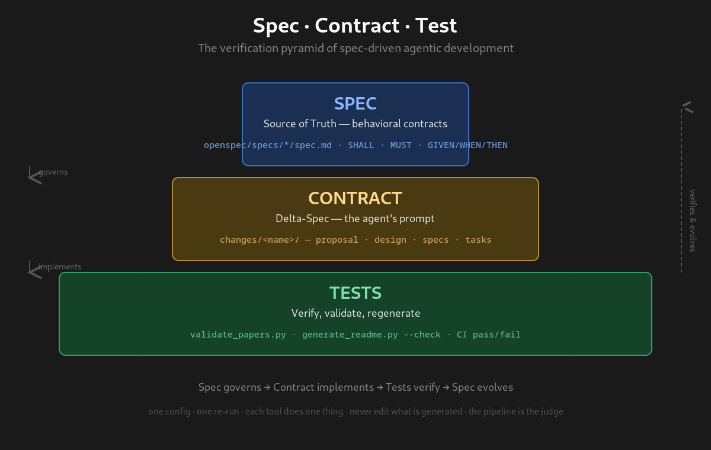

<p align="center">
  
</p>

<h1 align="center">Agentic AI in der Praxis</h1>
<p align="center"><b>Vom Spec zum produktiven Workflow</b> · IT4Science Days 2026 · 3h Workshop (09:00–12:00) · Deutsch</p>

> **⚠️ Migrated from Codeberg → GitHub**: This repository lives on [GitHub](https://github.com/tobias-weiss-ai-xr/IT4Science-Days-2026-agentic-ai-workshop). A Codeberg mirror is kept in sync manually.
>
> **Diese README ist die einzige Quelle der Wahrheit für den Ablauf.** Die Marp-Folien liegen unter `docs/presentations/`.

---

## Über den Workshop

Dieser Workshop auf den IT4Science Days 2026 zeigt praxisnah, wie Large Language Models heute **agentisch** genutzt werden können, welche neuen Möglichkeiten sich daraus ergeben und wie solche Ansätze sinnvoll in eigene Projekte integriert werden können.

Im Mittelpunkt steht ein **Hands-on**: Jede Teilnehmende verlässt den Raum mit einem eigenen, CI-validierten Research-Repo und einem selbst geschriebenen, implementierten **Spec-Change**.

### Die zentrale Metapher: Spec · Contract · Test

Der ganze Workshop folgt einer Pyramide, die wir später live anwenden:

> **Spec governs → Contract implements → Tests verify → Spec evolves.**

| Ebene | Was | Rolle |
|-------|-----|-------|
| **Spec** (oben) | Verhalten als Verträge — SHALL/MUST/SHOULD, Given/When/Then | Source of Truth, das „Warum" |
| **Contract** (Mitte) | Delta-Spec — proposal → design → specs → tasks | der Prompt, den der Agent bekommt |
| **Test** (unten) | Verifikation — validate · --check · CI pass/fail | objektive Entscheidung |



## Referenten

| Name | Institution |
|------|-------------|
| **Christian Uhl** | Zentrum für angewandte Informatik und Data Science, Universität Gießen |
| **Tobias Weiß** | DevOps Engineer, Universität Marburg — [tobias-weiss.org](https://tobias-weiss.org) |

Fortsetzung der Veranstaltungsreihe **HackyHour**.

## Agenda (3h, 09:00–12:00)

| Zeit | Block | Dauer | Verantwortung |
|------|-------|-------|---------------|
| 09:00–09:10 | Ankommen, Vorstellung, Ablauf | 10 min | beide |
| 09:10–09:25 | Grundlagen & Definition — Was ist agentisches Arbeiten? | 15 min | Christian |
| 09:25–09:45 | Aktuelle Entwicklungen bei den Foundation Modellen | 20 min | Christian + Tobias |
| 09:45–10:05 | Open-Source Toolbox — Harnesses (OpenCode, pi, zot) + Tooling | 20 min | Tobias + Christian |
| 10:05–10:15 | ☕ Pause | 10 min | — |
| 10:15–10:40 | **Anwendung 1: Eigenes Research Repo** — [skeleton-research](https://github.com/tobias-weiss-ai-xr/skeleton-research), Git, Harness | 25 min | beide |
| 10:40–11:00 | Spec Driven Development — Anforderungen als Treiber agentischer Entwicklung | 20 min | Christian |
| 11:00–11:10 | Token-optimized Development — Modell-Routing, Caching | 10 min | Tobias |
| 11:10–11:35 | **Anwendung 2: Spec selbst anwenden** (im Research Repo) | 25 min | beide |
| 11:35–11:40 | ☕ Pause | 5 min | — |
| 11:40–12:00 | Q&A, TN präsentieren Outcomes, Diskussion, Wrap Up | 20 min | beide |

**Lernlogik der Reihenfolge:**
Grundlage → Werkzeuge → **sofort selbst anwenden (Research Repo)** → Vertiefung (Spec/Token) → **Spec selbst anwenden** → Austausch.

> Details und Rankings zu Foundation Models & Toolbox: [`docs/research-foundation-models-toolbox.md`](docs/research-foundation-models-toolbox.md).

## Foundation Models — aktuelle Entwicklungen (Auszug)

Einordnung, warum agentisches Arbeiten 2026 möglich ist:

- **Reasoning-Modelle** reif — Rechenzeit skalieren statt nur Parameter.
- **Kontextlängen explodieren** (200K → 1M+ Token) — ganze Codebases & Specs im Kontext.
- **MCP** (Model Context Protocol) wird Standard-Tool-Schnittstelle.
- **Tool-Use & Multi-Agent** sind Produktionsreif, nicht mehr Demo.
- **OpenSource holt auf** (Qwen, GLM, DeepSeek, GPT-OSS, Llama, Gemma) — **Kosten-Kollaps**.
- **Lokale & souveräne Modelle** (Ollama, vLLM, llama.cpp) — DSGVO-freundlich.

## Open-Source Toolbox

### Harnesses (Steuerungsebene über dem Modell)

> Gleiche Modelle, unterschiedliche Ergebnisse — **je nach Harness**.

| Harness | Rolle | Setzen wir ein für |
|---------|-------|--------------------|
| **OpenCode** | CLI-Coding-Agent, Multi-Model-Routing (LiteLLM), LSP+AST-grep, Plugins | tägliche Coding-Agents |
| **pi** | minimaler Terminal-Harness, erweiterbar (Skills, Extensions, Themes) | kontrollierte Workflows · dieser Workshop |
| **zot** | schlankes Agent-Harness mit TUI + JSON-RPC/SDK | Headless & Automation |

### Weiteres Tooling

| Tool | Funktion |
|------|----------|
| **OpenSpec** | Spec-driven Development — Delta-Specs als Agenten-Prompts |
| **SAIA Accelerator** | Plugin für OpenCode/zot/pi — GWDG Chat-AI-Modelle, Auto-Sync |
| **oh-my-opencode** | Token-optimierte Agent-Routing (benannte Agents je Aufgabe) |
| **Superpowers Skills** | TDD, Debugging, Brainstorming, Review als wiederverwendbare Routinen |
| **Ollama / vLLM / llama.cpp** | Lokales Modell-Serving auf eigener Hardware |

> **Das Modell ist das Gehirn, die Workflows sind der Muskel.**

## Hands-on 1: skeleton-research

Das Herzstück des Workshops. [skeleton-research](https://github.com/tobias-weiss-ai-xr/skeleton-research) ist ein forkbares Skeleton für eine **datengetriebene, auto-validierte, agentische Literatur-Review** — dieselbe Architektur wie die `*-research`-Corpus-Repos. Auf die Pyramide übertragen: `papers.yaml` = **Spec**, Pipeline/AGENTS.md = **Contract**, CI = **Test**.

- **Eine Datei genügt:** `config/taxonomy.yaml` (Thema, Kategorien, Queries) anpassen → Pipeline läuft.
- **Source of Truth:** `papers.yaml` — ein strukturierter Eintrag pro Paper.
- **Auto-Pipeline:** `validate_papers.py` → `generate_readme.py` → `standard_stats.py` → `generate_reports.py`.
- **Auto-Discovery:** CI entdeckt wöchentlich neue Paper (arXiv, OpenAlex, dblp, crossref, europepmc) und öffnet PRs.
- **GitHub Pages:** durchsuchbare Paper-Browser-Seite.
- **Agenten-tauglich:** `AGENTS.md` gibt Coding-Agenten klare Guardrails — eine Config, ein Re-Run, objektiver Pass/Fail.

**5-Schritt-Jump-Start:**

```bash
git clone https://github.com/tobias-weiss-ai-xr/skeleton-research.git my-topic-research
cd my-topic-research
# 1. Thema & Taxonomie definieren
$EDITOR config/taxonomy.yaml
# 2. Corpus seeden (5–10 Paper) oder auto-discovern
python3 scripts/fetch/fetch_new_papers.py --local
# 3. Validieren + generieren
python3 scripts/validate_papers.py && python3 scripts/generate_readme.py \
  && python3 scripts/standard_stats.py && python3 scripts/analysis/generate_reports.py
# 4. Commit & push
git add -A && git commit -m "bootstrap corpus" && git push
# 5. CI hält den Corpus gesund (wöchentliche Discovery, Validierung, Pages-Deploy)
```

## Hands-on 2: Spec selbst anwenden

Einen eigenen Mini-**OpenSpec-Change** strukturieren (`proposal.md` → `specs/` → `tasks.md`) und von einem Agenten implementieren lassen. Referenz ist der fertige Change **`add-research-gap-analysis`** im Repo [ai-literacy-research](https://github.com/tobias-weiss-ai-xr/ai-literacy-research):

```bash
openspec propose "Füge eine Trend-Auswertung pro Kategorie hinzu"
# → proposal / design / specs / tasks generieren
# → Agent implementieren → validate → CI
```

> Regel aus der Pyramide: Tasks erst **done**, wenn die Verifikation (CI/--check) grün ist.

## Arbeitsmaterialien

- `docs/presentations/it4science-days-2026-agentic-ai-workshop.md` — Marp-Folien (`.html` = gerendert)
- `docs/research-foundation-models-toolbox.md` — Recherche: Foundation Models & Toolbox (Ranking)
- `assets/spec-contract-test-pyramid.png` — die Spec·Contract·Test-Metapher
- `assets/teaser.png` · `assets/teaser-banner.png` — Banner für Social/Titel

## Links

- [IT4Science Days Eventseite](https://plan.events.mpg.de/event/670/)
- [Impuls zu SpecDrivenDevelopment (GWDG News)](https://gwdg.de/about-us/gwdg-news/2026/GN_05-2026_www.pdf#page=14)
- [skeleton-research](https://github.com/tobias-weiss-ai-xr/skeleton-research) — forkbares Research-Corpus-Skeleton
- [ai-literacy-research](https://github.com/tobias-weiss-ai-xr/ai-literacy-research) — OpenSpec-Showcase (Research-Gap-Analyse)
- [SAIA Plugin für OpenCode](https://codeberg.org/graphwiz-ai/opencode-saia-plugin/src/branch/bleedingEdge)
- [OpenCode](https://github.com/sst/opencode) · [OpenSpec](https://github.com/FissionAI/OpenSpec) · [pi](https://pi.dev)
