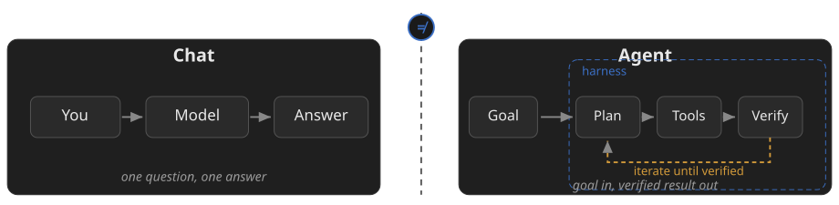
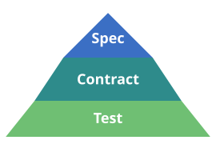
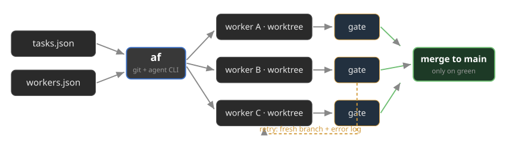

<!-- _class: lead -->

# Agentic AI in Practice

## From Spec to Productive Workflow

Tobias Weiß · DevOps, University of Marburg

GöAID Session · Academic Cloud

<!-- notes:
(1 min) Welcome. Sentence 1: This is not a talk ABOUT agents — it is
the story of an operation that is built and run BY agents.
30 min of content + 10 min of questions.
-->

---

## Where I come from

- openEduSuite: sovereign groupware suite
- Bare-metal Kubernetes, in production
- AI in the suite, agents on the operation
- Real mailboxes, real students, real outages

> A story from production, not a demo.

<!-- notes:
(2 min) Context: University of Marburg, DevOps. The suite runs
productively on our own bare-metal nodes (SCS-K8s), not in a public
cloud. Two directions of "AI-infused": (a) the suite carries its own
LLM/K8s resources (k8s/llm), (b) the operation itself is done
agentically — the latter is the subject of this talk.
-->

---

<!-- _class: smaller -->

## Roadmap — 30 minutes

| Block | Content | Time |
|---|---|---|
| 1 · Foundations | Model + harness + loop | ~8 min |
| 2 · Method | Spec → Contract → Test | ~10 min |
| 3 · Practice | Four real cases | ~12 min |

Then: **10 minutes of questions.**

<!-- notes:
(30 s) Show, don't read. Block 3 is the heart — the four cases are
real incidents/projects with dates and outcomes.
-->

---

## Agentic ≠ chat



> "Agentic" is a working environment.

<!-- notes:
(1.5 min) Point at the graphic, don't read it. Left: chat = one
question, one answer — the model cannot touch a file. Right: agent =
goal → plan → tools → verify, inside a harness that gives tools and
rules; the amber loop is where the work happens. Lesson from our
courses: many expect "ready-made bots" — set that term straight here.
-->

---

## The harness decides

- Terminal agent: files, git, cluster
- pi: MCP tools, skills, memory
- Plan mode: consent before changes

> Permissions live in the contract, not in gut feeling.

<!-- notes:
(2 min) Same model, different frame: chat window vs. terminal agent
with file, git and cluster access. Briefly show or describe pi:
opens terminals, reads files, runs git, calls MCP tools. Plan mode =
consent before any change. Ops crowd: the agent has the same rights
I have at my workstation — hence the contract.
-->

---

## pi in 60 seconds

```bash
curl -fsSL https://pi.dev/install.sh | sh
npm install -g --ignore-scripts @earendil-works/pi-coding-agent
```

- v1.0: fullscreen · lean codemode · images
- **Ctrl+L** — switch model mid-session
- **Ctrl+P** favorites · **Shift+Tab** thinking
- Provider-agnostic · `/hotkeys` lists all

<!-- notes:
(1.5 min) Install is two lines — live-demoable. v1.0 released
2026-10-01, currently 1.0.2. Ctrl+L is THE shortcut to demo: switch
model mid-task — cheap model for research, strong model for the fix.
If someone asks "which key does X": run /hotkeys live. Nix users:
nix run github:earendil-works/pi/stable. Radius login and MCP OAuth
hardening are also in 1.0 — mention if asked.
-->

---

## "Can it leak my keys?" — pi-sandbox

- Escape probes + real exfiltration test
- Recommended Docker: stops accidents only
- Hardened flags: pi won't even start
- Works: seccomp, gVisor, secrets-broker

> Sandboxing is a measurement, not a checkbox.

<!-- notes:
(1.5 min) Earns trust with the ops audience: we TESTED the isolation
instead of trusting docs. Findings: (1) recommended setup = safe
against accidents only — a malicious agent exfiltrates the one key
you pass in; (2) documented hardening crashes pi (--read-only breaks
the session directory). Survivors: seccomp + noexec (egress cut),
non-root without network (local models), gVisor, secrets-broker —
the real key never enters the sandbox.
github.com/tobias-weiss-ai-xr/pi-sandbox · THREAT_MODEL.md
-->

---

<!-- _class: smaller -->

## The pyramid: Spec · Contract · Test



| Level | Rename every domain | Prove every login |
|---|---|---|
| **Spec** | New domain everywhere, nothing else | 15 services, login + logout |
| **Contract** | Plan first, rerun-safe script | Fix, never silence a warning |
| **Test** | Second run = zero diff | 59 automated checks green |

Both are real openEduSuite cases — Cases 1 and 4.

> Every level is text in the repo.

<!-- notes:
(2.5 min) Core slide. Pyramid: Spec (WHAT) on top, Contract (HOW)
in the middle, Test (WHEN is it right) as the foundation. The two
columns are two EVERYDAY scenarios, not project jargon: a risky
one-time change (we renamed all domains in production — Case 1) and
proving a promise (login must work for all 15 services — Case 4,
the 59-check SSO suite). Read the table row by row: same three
levels, very different changes — that is why it is a method, not a
trick. All levels live in git, not in heads or chats. Transition:
"How do you get from this pyramid to a running workflow? → OpenSpec."
-->

---

## From spec to change: OpenSpec

- Change = proposal + spec delta + tasks
- Agent implements, human reviews, archives
- Archive: main spec is the new state

```text
Spec → Contract → Agent
   → Verify (tests) → Operate (ArgoCD)
```

> Documentation is the product.

<!-- notes:
(1.5 min) OpenSpec CLI: new change, continue, apply, archive. The
flow: proposal by human or agent, refinement in dialogue, then work
through tasks. Key point: "archive" updates the specs — that is how
the docs stay in sync with the system.
-->

---

## OpenSpec × pi

- `pi install npm:openspec-pi`
- Agent queries spec state mid-task
- Auto-context: injected at session start
- `/opsx-new` · `apply` · `verify` · `archive`

> The spec is the agent's operating context.

<!-- notes:
(1 min) Closes the loop between method and harness: the Spec→
Contract workflow is wired directly into pi. Fresh session in a repo
with openspec/ starts already knowing the change state (auto-injected
context, invalidated when the spec tree changes). /opsx-verify
before commit is the habit to copy: validate + doctor sweep.
Requires OpenSpec CLI >= 1.9 on PATH.
-->

---

<!-- _class: smaller -->

## The stage: openEduSuite

| Component | Service | | Component | Service |
|---|---|---|---|---|
| Identity | **Keycloak** (SSO) | | Chat | **Matrix/Synapse** |
| Groupware | **SOGo** | | Projects | **OpenProject** |
| Files | **OpenCloud** | | Video | **Jitsi/Intercom** |
| Wiki | **XWiki** | | Portal | **collab-dashboard** |

- ArgoCD GitOps · bare metal · Galera
- Agents on production: spec first, tests accept

<!-- notes:
(1.5 min) Locate the audience: anyone running something similar knows
these components. One login, eight services. The bottom bullet is the
core tension of this talk: agents with write access on production —
how do you make that accountable? Answer: the next four cases.
-->

---

## Case 1 · Domain migration, as a spec

- Cutover: `home.openedu` → `suite.graphwiz.ai`
- Ingresses, certificates, redirects, mail
- Contract: idempotent script, guards 157 + 8
- Agent implements · checks green · then run

> Nerve-racking cutover becomes routine: just rerun.

<!-- notes:
(2.5 min) The point: without a spec this is a week of manual work and
fear. With a spec: one script with built-in guards. Idempotency is
the acceptance criterion — a second run changes nothing. Story: on
the first run a guard check fired (one directory matched too much) —
exactly what guards are for. Also in scope: Keycloak redirects,
Let's Encrypt wildcard, oauth2-proxy fixes.
-->

---

## Case 2 · SSO mystery

- Symptom: white page after SAML login
- Plan mode: hypotheses → probes → fix
- Causes: dead domains, TLS hop, ACS URL
- Stalwart: dead OIDC issuer in directory

> Debugging: symptom in, root-cause chain out.

<!-- notes:
(2.5 min) Tell it live; everyone knows white pages. SOGo webmail
after SAML login — three root causes in a row: repo/deploy still on
old domains + placeholder IdP metadata (by design); TLS termination
at the ingress vs. ACS-URL scheme. The agent needed several probes —
but every hypothesis was visible. Second case, same pattern: Stalwart
XOAUTH2 broke on a dead OIDC issuer inside a directory object.
Afterwards each root cause became a probe in the test suite. Key
line: "Every bug found becomes a test before it comes back."
-->

---

## Case 3 · "Fix-all": drift to GitOps

- k8s directories without an ArgoCD app
- Legacy from imperative applies
- Orders: every app GitOps, diffs explained
- Side finding: `k8s/llm` — same suite

> Boring, important work — perfect for agents.

<!-- notes:
(1.5 min) Tenant mail, LLM, XWiki directories were never under any
ArgoCD app. This work is tedious and important — perfect for agents.
The human defines what is "done": app exists, sync green, no
unmanaged manifests left. The agent works through the list. Message:
start with tasks like this, not with "write my thesis".
-->

---

## Case 4 · Fleet with acceptance gates

- SSO suite: 59 checks, 15 clients e2e
- Built in batches by parallel workers
- Isolated worktrees, exact criteria
- Merge only on green — else discarded

> Many small orders — not one super-agent.

<!-- notes:
(1.5 min) The tool here is agentflow (next slide). This is how the
e2e checks for all SSO clients were built — logout per client type,
session TTL, scopes. A human would have spent weeks clicking through
this. Scalable, cheap, auditable.
-->

---

## The tool: agentflow (`af`)



- Rust orchestrator, thin by design — 71 tests, no network in CI
- Retries: fresh branch + error history in the prompt
- Routing by track record — receipts in `af cost`

> Contracts once — the runner enforces the gates.

<!-- notes:
(1.5 min) Walk the graphic: declarative tasks + workers, af fans out
into isolated worktrees, every result passes a gate (exit 0) before
merge; amber path = retry with error memory. UCB1 = workers earn
trust by track record. Demo path: af run --dry-run, af status,
af cost. github.com/tobias-weiss-ai-xr/agentflow
-->

---

## What the operation learned

- Tight specs beat big contexts
- Agents need contracts, not faith
- Every incident becomes a test

> Trust is good. Verification is cheaper.

<!-- notes:
(1.5 min) Three lessons, phrased for operations. Token case: a tight
spec with 5 acceptance criteria beats a 1000-line prompt — fewer
tokens, same quality. Expectations: people want "finished bots" and
get a tool with rules. Test first: the SSO suite was built exactly
this way (59/0/6, every warning a documented decision).
-->

---

## Apply it to your project

1. Contract first: `AGENTS.md`
2. Spec change before code
3. CI green = done
4. Memory in the repo, not the chat

> Start with one boring, important task.

<!-- notes:
(1.5 min) The transfer slide: the audience should be able to do one
thing tomorrow. Point 1 costs 20 minutes and changes everything —
the agent reads the contract on every start. Point 4: experiences /
spec repo instead of chat history. Not "an agent replaces me".
-->

---

## Resources

- openEduSuite · openedusuite.graphwiz.ai
- pi · pi.dev — docs: pi.dev/docs
- pi-openspec · npm:openspec-pi
- pi-sandbox · evidence + threat model
- agentflow · worktrees + gates
- Workshop repo · IT4Science-Days-2026-agentic-ai-workshop

<!-- notes:
(30 s) Do not read aloud. Everything named here is public and
tangible: repos, specs, test suites — no slide magic. GitHub user:
tobias-weiss-ai-xr. The workshop deck (3h version, IT4Science Days
2026) is public too — deeper dive = do the exercises.
-->

---

<!-- _class: lead -->

# Thank you!

## Questions? — 10 minutes

Tobias Weiß · `tobias.weiss@uni-marburg.de`

GöAID · openEduSuite · University of Marburg

<!-- notes:
(10 min) Q&A. Likely questions: agent permissions/security (→
contract + plan mode + tests), model choice (→ harness is
model-agnostic, Ctrl+L, pi runs with various providers), cost (→
tight specs, small orders), getting started (→ AGENTS.md + one
boring task).
-->
